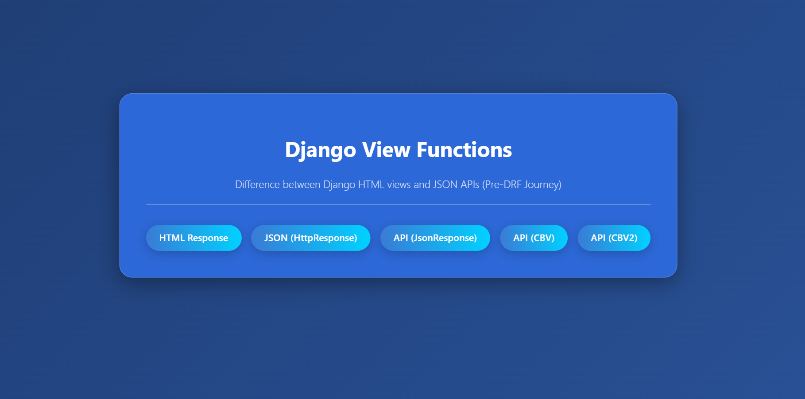

# Django Without REST

This project is created while learning Django fundamentals and transitioning towards Django REST Framework (DRF).

It demonstrates how to return data using different approaches like:

- `HttpResponse`
- `JsonResponse`
 Function-Based Views (FBV)
- Class-Based Views (CBV)
- Custom Mixins
- Python API consumption using `requests`
- Basic API testing

---

### ⚡ Dashboard Page


---

# 🚀 Project Purpose

The main goal of this project is to understand:

- How Django views work
- Difference between HTML response and JSON response
- How APIs evolve from simple Django views to DRF structure
<!-- Basics of Function-Based Views (FBV) -->
- Basics of Class-Based Views (CBV)
- Handling different HTTP methods
- Creating reusable custom mixins
- Consuming APIs using Python client scripts
- Writing basic API tests

---

# 📌 Features Covered


## 1. Function-Based Views (FBV)

- Returning HTML response using `HttpResponse`
- Returning JSON using `json.dumps()`
- Using `JsonResponse`
---


## 2. Class-Based Views (CBV)

- Basic GET request handling
- Handling multiple HTTP methods:
  - GET
  

---

## 3. Custom Mixins

Created reusable custom mixin class inside:

```bash
testapp/mixins.py
```

Features:

- Reusable response rendering logic
- Cleaner CBV code
- Better code reusability
- DRF-style architecture understanding

Used in:

```python
class JsonCBV2(View, HttpResponseMixin)
```

---

## 4. Python API Client

Using Python `requests` library to:

- Consume Django APIs
- Fetch JSON data
- Parse API responses
- Display API data in terminal

Files:

```bash
test1.py
test2.py
```

---

## 5. Basic API Testing

- Added Python testing scripts
- Practicing API response handling
- Understanding API validation concepts

---

# 🧑‍💻 Example Endpoints

| Endpoint | Description |
|----------|-------------|
| `/emp/` | Returns HTML response |
| `/emp/json/` | Returns JSON using HttpResponse |
| `/emp/json-response/` | Returns JSON using JsonResponse |
| `/api/json-cbv/` | Class-based JSON response |
| `/api/json-cbv2/` | Handles GET, POST, PUT, DELETE methods |

---

# 📂 Project Structure

```bash
django-to-drf-learning/
│
├── testapp/
│   ├── views.py
│   ├── urls.py
│   ├── mixins.py
│
├── test1.py
├── test2.py
├── manage.py
└── README.md
```

---

# ⚙️ Technologies Used

- Python
- Django
- JSON Handling
- HTTP Methods
- Requests Library
<!-- 
- Function-Based Views
-->
- Class-Based Views
- Custom Mixins

---

# 📚 Learning Outcome

Through this project, I learned:

- Difference between HTML and JSON responses
- How APIs work internally
- Why REST APIs are important
- How CBVs make code cleaner and structured
- How reusable mixins reduce code duplication
- How Python applications consume APIs
- Basics required before learning Django REST Framework (DRF)

---

# 🚧 Next Steps

- Move towards Django REST Framework (DRF)
- Learn Function-Based API Views
- Learn Serializers
- Learn APIView
- Add database models
- Add CRUD operations
- Add Authentication & Permissions
- Connect frontend with APIs

---

# 👨‍💻 Author

**Sajjad Ali**

Learning Django & DRF step by step 🚀


## ⭐ Star this repository if you found it helpful and useful while learning Django & DRF.
